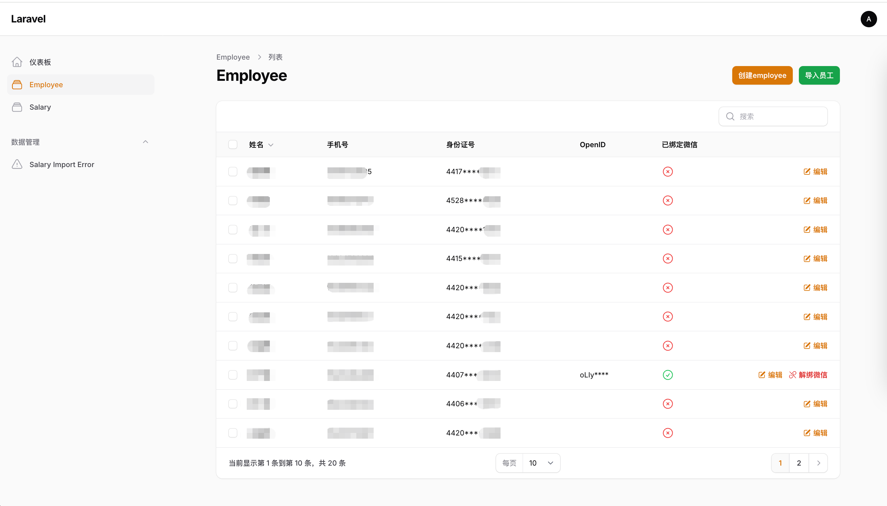
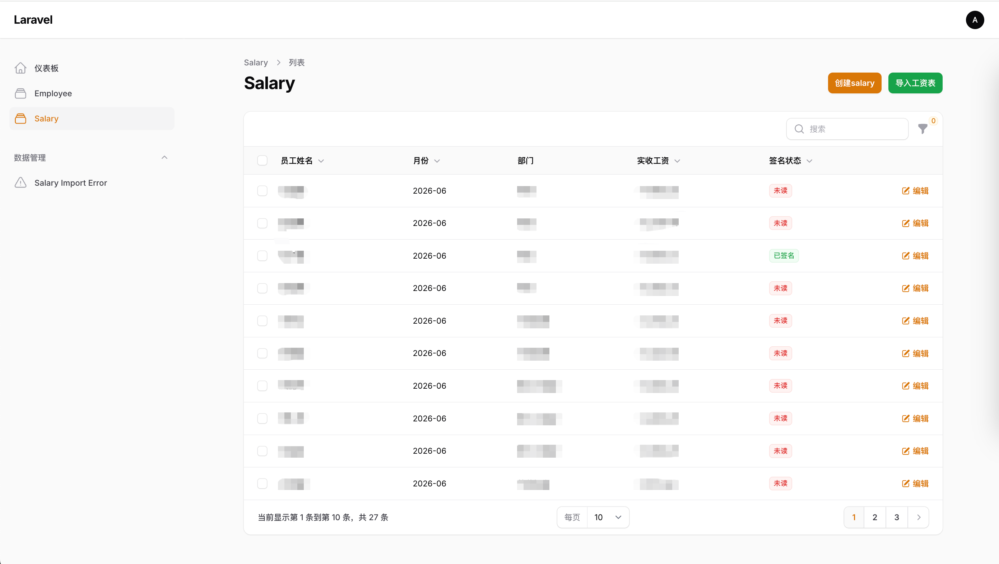
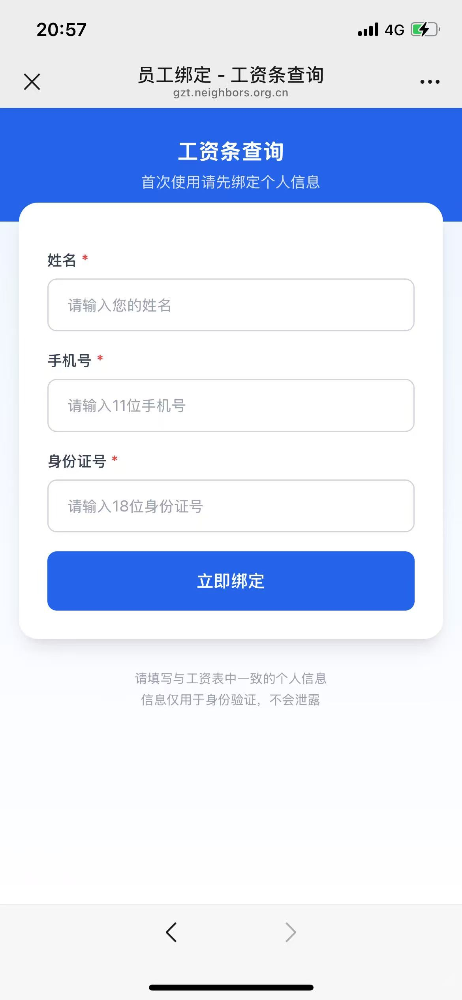
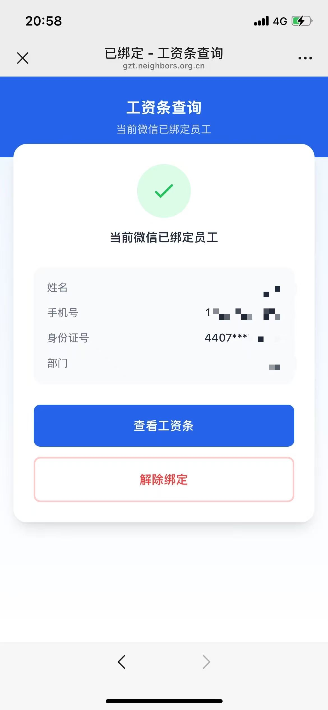
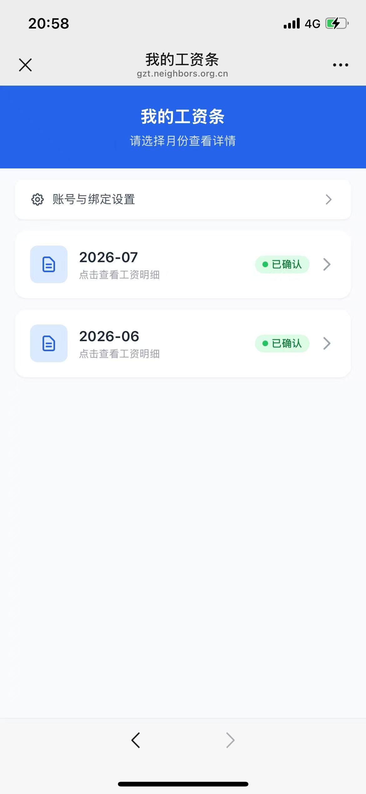
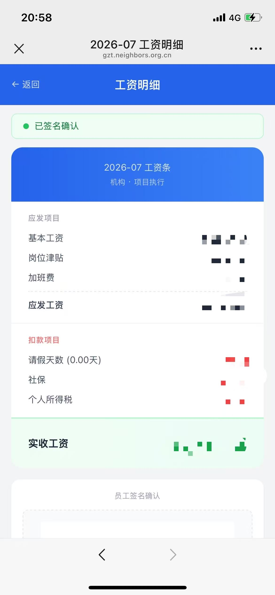
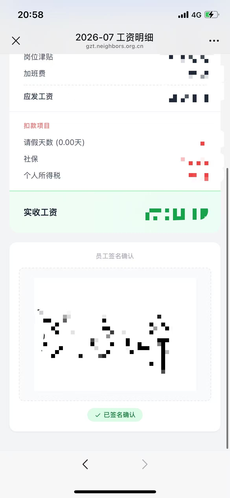

# 工资条查询系统

一套面向企业员工的微信公众号工资条查询与电子签名系统，采用 Laravel 10 + Filament v3 构建，支持 Excel 批量导入、微信 OAuth 绑定、状态流转与电子签名确认。









## 技术栈

| 层级 | 技术 | 版本 |
|------|------|------|
| 后端框架 | Laravel | 10.x |
| PHP | — | 8.1+ |
| 后台管理 | Filament | 3.x |
| UI 框架 | Livewire | 3.5.x |
| 数据库 | MySQL | 5.7+ / 8.0+ |
| H5 前端 | Laravel Blade + Tailwind CSS | — |
| 微信 SDK | EasyWeChat (overtrue/wechat) | ~6.0 |
| Excel 解析 | Laravel Excel (maatwebsite/excel) | ^3.1 |
| 电子签名 | Signature Pad (本地化) | 5.x |
| 图像处理 | PHP GD 扩展 | — |

## 功能特性

### 员工端 (H5)
- **微信 OAuth 授权**：通过微信公众号静默授权（snsapi_base）自动获取用户 OpenID
- **身份绑定**：员工使用姓名 + 手机号 + 身份证号三要素绑定微信账户，支持已绑定状态查看与解绑
- **互斥锁安全机制**：一个员工仅允许绑定一个微信号，防止信息泄露
- **工资条列表**：按月展示工资记录，含状态标签（未读 / 已读未签 / 已签名）
- **工资条详情**：完整展示应发、扣款、实发金额明细，自适应移动端
- **电子签名确认**：全屏手写签名板，签名图片经 GD 旋转 90° 后保存，全平台方向一致

### 后台管理 (Filament)
- **员工管理**：查看、编辑员工信息，显示微信绑定状态与脱敏 OpenID，支持强制解绑
- **工资管理**：按月筛选、按状态筛选、Excel 批量导入（含导入前校验与失败记录池）
- **导入失败记录池**：只读页面，展示导入时因"找不到员工"被跳过的记录，方便管理员排查
- **工资状态管理**：列表直观展示签名状态徽章（红/黄/绿）与签名缩略图预览
- **全面中文化**：时区 `Asia/Shanghai`，语言 `zh_CN`

## 快速开始

### 环境要求

- PHP 8.1+（需启用 GD、mbstring、openssl、pdo、tokenizer、xml 扩展）
- MySQL 5.7+ / 8.0+
- Composer 2.x
- Docker（推荐，项目默认容器名 `bt_dev_env`）

### 安装步骤

1. **克隆项目**
   ```bash
   git clone <repo-url> gongzitiao
   cd gongzitiao
   ```

2. **安装依赖**
   ```bash
   composer install
   ```

3. **配置环境**
   ```bash
   cp .env.example .env
   php artisan key:generate
   ```
   编辑 `.env` 文件：
   ```env
   APP_URL=https://your-domain.com
   DB_CONNECTION=mysql
   DB_HOST=127.0.0.1
   DB_DATABASE=gongzitiao
   DB_USERNAME=your_username
   DB_PASSWORD=your_password

   # 微信公众号配置
   WECHAT_OFFICIAL_ACCOUNT_APP_ID=your_app_id
   WECHAT_OFFICIAL_ACCOUNT_SECRET=your_app_secret
   ```

4. **执行迁移**
   ```bash
   php artisan migrate
   ```

5. **创建 Filament 管理员**
   ```bash
   php artisan make:filament-user
   ```

6. **创建存储软链接**
   ```bash
   php artisan storage:link
   ```

7. **（可选）发布静态资源**
   ```bash
   php artisan vendor:publish --tag=laravel-assets
   php artisan filament:install --panels
   ```

### Docker 环境部署

项目默认在 Docker 容器 `bt_dev_env` 中运行，容器内项目路径为 `/www/wwwroot/linshe/gongzitiao`。

```bash
# 进入容器执行命令
docker exec bt_dev_env bash -c "cd /www/wwwroot/linshe/gongzitiao && composer install"
docker exec bt_dev_env bash -c "cd /www/wwwroot/linshe/gongzitiao && php artisan migrate"
```

## 目录结构

```
app/
├── Http/Controllers/Api/
│   ├── SalaryController.php    # 工资条 API（列表/详情/签名）
│   └── WechatController.php    # 微信 OAuth / 绑定 / 解绑
├── Models/
│   ├── Employee.php             # 员工模型（扩展 Authenticatable）
│   ├── Salary.php               # 工资条模型
│   └── SalaryImportError.php    # 导入失败记录模型
├── Filament/Resources/
│   ├── EmployeeResource.php    # 员工后台资源
│   ├── SalaryResource.php      # 工资后台资源 + Excel 导入
│   └── SalaryImportErrorResource.php  # 导入失败记录只读资源
resources/views/h5/
├── layout.blade.php             # H5 布局（Tailwind CSS）
├── bind.blade.php               # 微信绑定页
├── list.blade.php               # 工资列表页
└── detail.blade.php            # 工资详情 + 签名页
routes/web.php                 # H5 + 微信路由定义
public/js/signature_pad.umd.min.js  # 本地化电子签名库
```

## 路由说明

### 微信授权路由
| 方法 | 路径 | 说明 | 鉴权 |
|------|------|------|------|
| GET | `/wechat/oauth` | 微信静默授权跳转 | 公开 |
| GET | `/wechat/callback` | 微信授权回调 | 公开 |

### H5 员工端路由
| 方法 | 路径 | 名称 | 说明 | 鉴权 |
|------|------|------|------|------|
| GET | `/h5/bind` | `h5.bind` | 绑定/解绑页面 | 公开（需 temp_openid） |
| POST | `/h5/bind` | — | 提交绑定 | 公开 |
| POST | `/h5/unbind` | `h5.unbind` | 解除绑定 | employees |
| GET | `/h5` | — | 根路径→跳转工资列表 | employees |
| GET | `/h5/salaries` | `h5.salaries` | 工资月份列表 | employees |
| GET | `/h5/salary/{month}` | `h5.salary.detail` | 工资详情 | employees |
| POST | `/h5/salary/{id}/sign` | `h5.salary.sign` | 电子签名保存 | employees |

### 后台管理路由
| 路径 | 说明 |
|------|------|
| `/admin` | Filament 后台入口 |
| `/admin/employees` | 员工管理（含强制解绑） |
| `/admin/salaries` | 工资管理（含导入、状态筛选） |
| `/admin/salary-import-errors` | 导入失败记录池（只读） |

## Excel 导入格式

工资 Excel 模板需包含以下列（第一行为表头）：

| 列名（必须） | 说明 |
|-------------|------|
| **姓名** | 员工姓名（必需） |
| **应付工资** | 应发金额（必需） |
| **实收工资** | 实发金额（必需） |
| 部门 | 部门名称（可选，缺失为 null） |
| 岗位 | 岗位名称（可选，缺失为 null） |
| 基本工资 | 基本工资金额（可选） |
| 岗位津贴 | 岗位津贴金额（可选） |
| 加班费 | 加班工资金额（可选） |
| 请假天数 | 请假天数（可选） |
| 扣请假工资 | 扣款金额（可选） |
| 社保费 | 社保金额（可选） |
| 个人所得税 | 个税金额（可选） |

**导入规则**：
- 系统动态定位表头行（查找"姓名"关键字）
- 必需列缺失会终止导入并提示具体缺失列名
- 非必需列缺失静默兼容，对应字段写入 null 或 0
- 员工姓名找不到时写入"导入失败记录池"，不中断批量导入
- "合计"行自动跳过

## 工资条状态流转

```
 0 (未读) ──访问详情──▶ 1 (已读·待签名) ──签名确认──▶ 2 (已签名)
```

| 状态 | 说明 | H5 展示 | 后台展示 |
|------|------|---------|---------|
| 0 | 初始状态 | 🔴 红色"未读" | 🔴 红色徽章 |
| 1 | 已查看待签名 | 🟡 黄色"未签名" | 🟡 黄色徽章 |
| 2 | 已签名确认 | 🟢 绿色"已确认" | 🟢 绿色徽章 + 签名缩略图 |

## 安全机制

- **互斥绑定锁**：员工一旦绑定微信，其他微信号无法再绑定（需管理员后台解绑）
- **三要素验证**：绑定需姓名 + 手机号 + 身份证号全部匹配
- **Session 鉴权**：员工端基于 Laravel Session + `auth:employees` Guard
- **CSRF 保护**：所有 POST 路由启用 Laravel CSRF Token
- **导入容错**：Excel 导入全链路校验，错误不中断，写入失败池供排查

## 生产部署 Checklist

- [ ] `.env` 设置正确的 `APP_URL`、数据库配置、微信配置
- [ ] `php artisan config:cache` 缓存配置
- [ ] `php artisan route:cache` 缓存路由
- [ ] `php artisan storage:link` 确保签名图片可公网访问
- [ ] 微信公众号后台配置授权回调域名
- [ ] SSL 证书（微信公众号要求 HTTPS）
- [ ] 定期清理 `salary_import_errors` 失败记录

## License

MIT License
